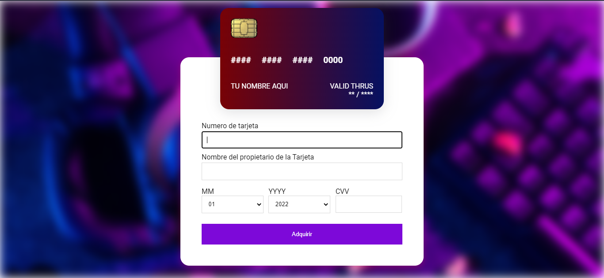
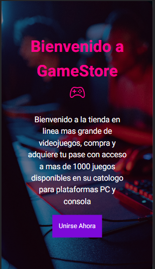
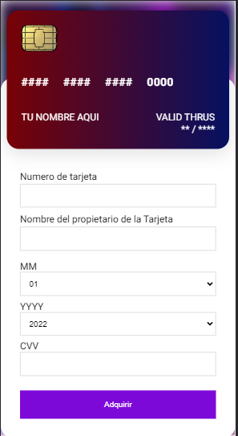
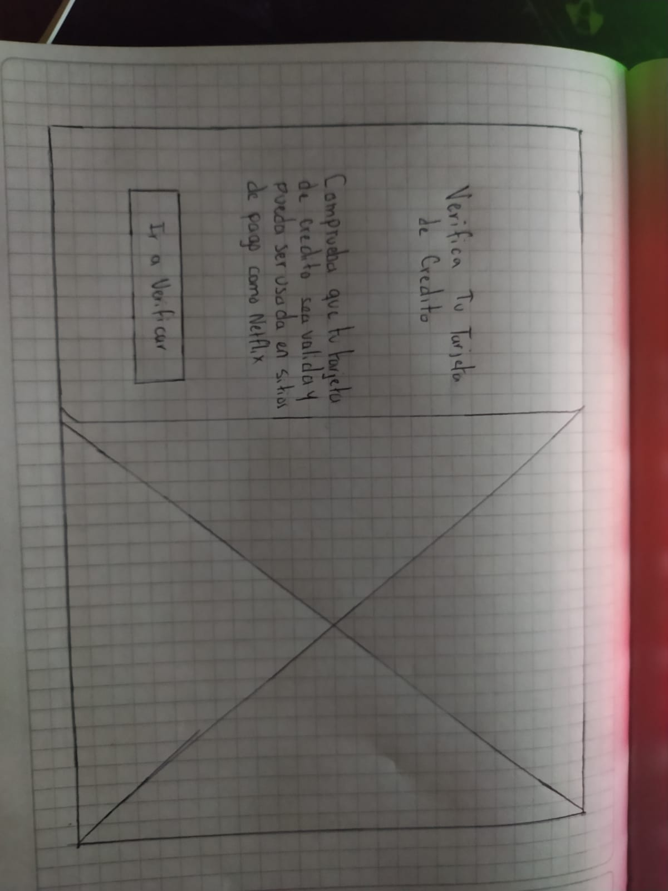
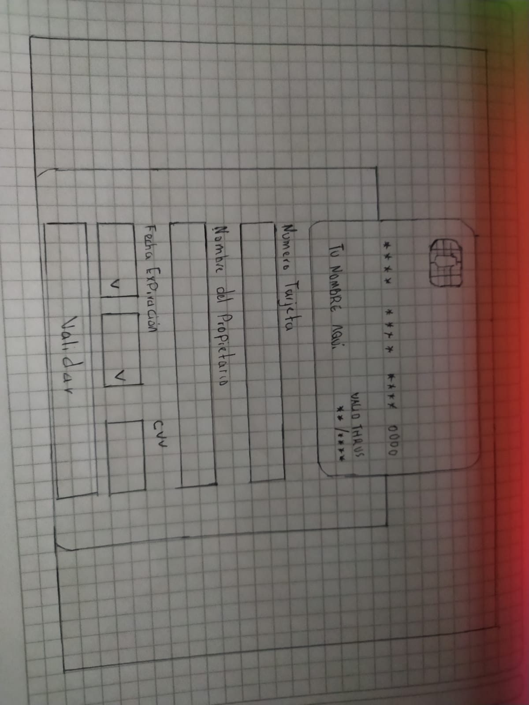

# GameStore 🎮

GameStore es una tienda virtual que ofrece la posibilidad de suscribirte y obtener acceso a más de 1000 disponibles para plataformas de PC y consola

## Imagen final del proyecto

### Diseño Desktop

### Diseño Mobile

## Investigación UX

### Usuarios Finales

Los usuarios finales a quienes está dirigida esta propuesta son todas aquellas personas que deseen adquirir un pase premium con acceso a más de 1000 videojuegos disponibles para plataformas de PC y consolas

### Problema que Solucionamos

Muchos usuarios deben pagar altas sumas de dinero por adquirir un solo videojuego, en GameStore se tiene pase a mas de 1000 videojuegos, entre ellos incluidos videojuegos de altos requisitos como la saga de Farcry, Call Of Duty, Assasins, entre otros reconocidos videojuegos. De la misma manera, cuenta con un sistema de pago muy seguro e interactivo sin intermediarios que valida tu tarjeta y verifica que sea valida siendo mas agradable al usuario el proceso de compra

### Primer prototipo

### Feedback recibido

El prototipo inicial solo era una pagina cuya finalidad era comprobar que el número de tarjeta ingresada fuera valido, ante esto, recibí sugerencias de darle una finalidad más completa, así que decidí aplicarlo orientando mi idea hacia una tienda de videojuegos donde para adquirir la suscripción es necesario validar la tarjeta de crédito

### Imagen del prototipo final

El prototipo final se encuentra disponible en Figma

[Ver aqui diseño en Figma](https://www.figma.com/file/kUQ1cpx7mqCg1DaXyRxWnz/Card-Validator_Laboratoria?node-id=0%3A1 )
